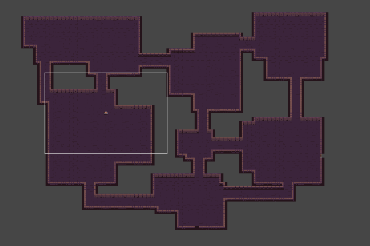
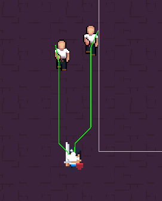
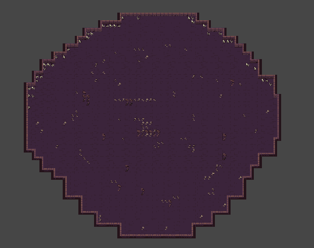
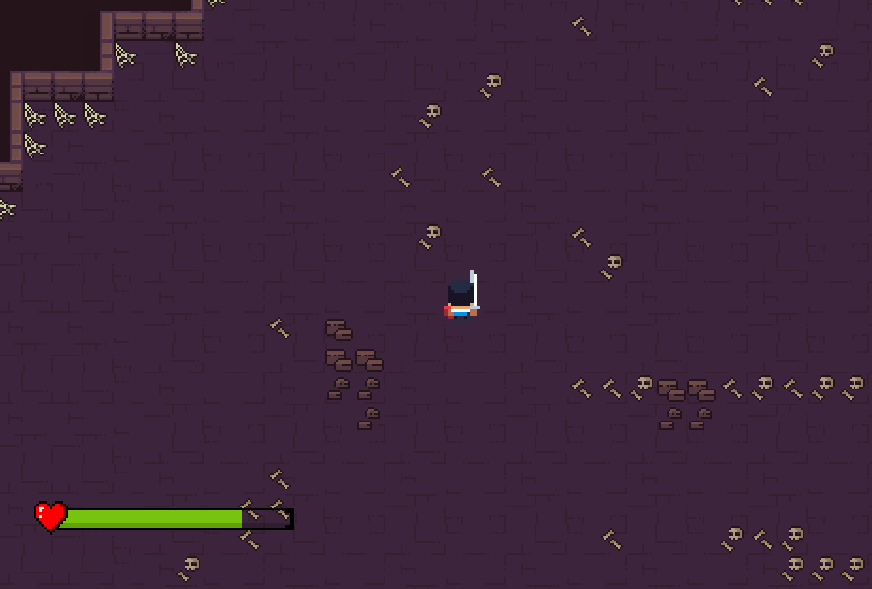

# Name: Labyrinthian Legends: Quest for the Lost Chambers

## Team Members: Bhumir Patel, Brian Merino, James Shastid, David Wilkey, Sulaiman Mohyuddin

### Section 1: Introduction
* Our project is to build a 2D dungeon game that includes enemies, a boss, and randomly generated mazes.
* The motivation for the project is to create a simple yet entertaining game. Additionally, we plan to use the game development process as an educational opportunity for learning how to use tools such as Unity and C#.
* Our approach to this project involved finding a game engine that would suit us best and delegating tasks to specific members of the group (UI, Characters).
* While at first, our idea was to develop this game for multiple devices such as PC and mobile, We faced a challenge in designing the game for mobile. The challenge that arose was the controller for the mobile gameplay would be completely different which would and the screen would be crowded with buttons.
* Another significant change came from the design of the main character. The original one did not fit the theme the best and was only able to attack by hand. The new player fits the theme better and can switch between hand or sword.
* We were able to accomplish our original idea of creating a maze, enemies, and a final boss. Additionally, we had a great learning opportunity when it came to using GitHub with Unity and developing components, prefabs, and scriptable objects.

### Section 2: Customer Value
* A change from our customer values comes from our measure of success. Due to the game not being fully polished, we have not been able to publish into game stores. Therefore, we have not been able to measure through our original means of customer rating and social media presence. We decided not to release our game during SPRINT 4 due to our thoughts of how the game currently runs.

### Section 3: Technology
* The Unity Engine will be the primary technology that we use due to the robust amount of pre-existing software tools that it has and the supportive community with plenty of documentation allowing for a more streamlined development process.
* Testing - The Unity Engine allows developers to play their game as they develop it. It allows for playing on the computer that the game engine is installed on. We used this to test the game as we made it for bugs and to see if the new scripts and components worked as intended.

* Maze:

    

* Enemy with pathfinding:

    

* Final-Boss Room:

    

* Hero:

    

* All of the technology we decided to use in the beginning of the semester is what we stuck with throughout the project lifecycle.

### Section 4: Team
* Roles
    * Grady: Project Leader
        * Grady was the project leader since he had the most experience with Unity. He would go through everyone's progress to help out and make suggestions. Additionally, he created the inventory system, the final boss, and put everyone's components together.
    * Bhumir: Maze Generation and Room Creation
        * Bhumir was in charge of creating a different maze each time it loaded up so that no maze was the same. Additionally, he created the playable rooms.
    * Brian: Enemy Creation and Attack
        * Brian was in charge of creating the enemy animations, and attacks. Furthermore, he created a script that would target the player if he got close.
    * Sully: Music and UI
        * Sully was in charge of the music that would be played on the main menu and during gameplay. Additionally, he was in charge of creating different menus such as the main menu and pause menu. Finally, he also created the health bar UI for the player and the final boss.
    * Tanner: Player Creation and Movement
        * Tanner was in charge of creating the main player. He was able to accomplish the animation, attack, and different actions for different buttons. For example, he was able to toggle if the player had a sword and shield if "C" was pressed, this allowed the player to move faster or slower depending on the toggle.
    * Role Changes:
        * While these roles were pretty much static, we did change to help out each other if they needed something first to be built.
     
### Section 5: Project Management
  * Did we meet the project goal?
      * Sadly we didn't meet all the project goals we initially had. However, we were able to finish the minimal system and added some features to it as well.
  * Reasons:
      * The majority of the group was learning how to use both Unity and GitHub.
      * Since we used GitHub, Unity gave us a lot of merge errors and fatal git pushes. This occurred because of .unity files that were generated and changed while members changed scenes.
      * Lastly, due to some members having different schedules, jobs, and commitments, we ran out time to add all the features we wished for. 
